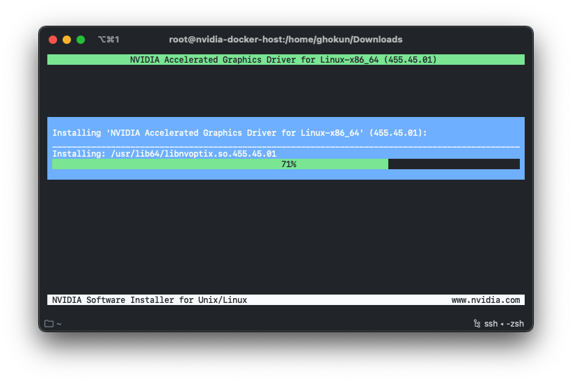
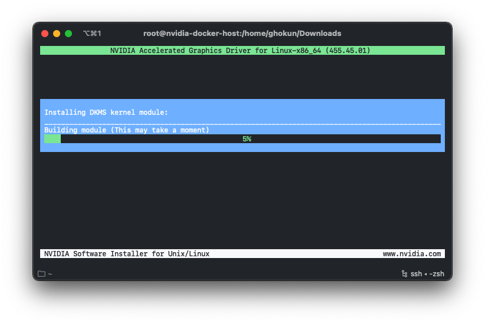
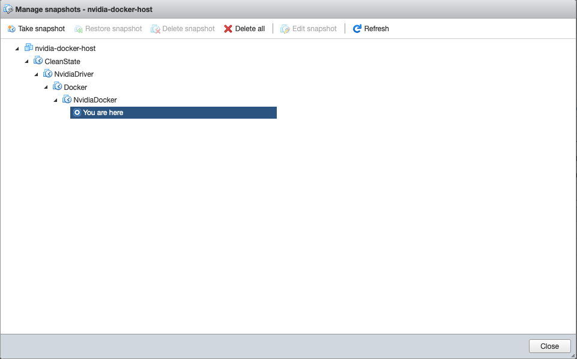

# nvidia-docker-host
Installation details of a virtual machine with nvidia-docker to run CUDA in containers.

- This repository uses tutorial from [here](https://www.if-not-true-then-false.com/2020/install-nvidia-container-toolkit-on-fedora/). If you want to thank someone please thank them. I am creating this repository for my own usage.


> VMware ESXi 6.7.0 Update 3 (Build 15160138) is used in this demo with a server having following specs.
```
Motherboard : ASUS Z8NA-D6
CPUs        : 2x Intel Xeon L5640 (SSE4.2)
RAM         : 96GB ECC 1333Mhz
```
## Create a virtual machine with following properties
```
CPU     : 4 vCPUs
RAM     : 16GB
Storage : 128GB Thin
OS      : Fedora 33 Workstation
Boot    : EFI, Disable secure boot

* Change specs according to your needs
```

## Update to Latest Kernel and install Open SSH Server
```bash
sudo dnf update -y
sudo dnf install openssh-server
sudo systemctl enable sshd
sudo reboot
```

```bash
[ghokun@nvidia-docker-host ~]$ neofetch
          /:-------------:\          ghokun@nvidia-docker-host
       :-------------------::        -------------------------
     :-----------/shhOHbmp---:\      OS: Fedora 33 (Workstation Edition) x86_64
   /-----------omMMMNNNMMD  ---:     Host: VMware7,1 None
  :-----------sMMMMNMNMP.    ---:    Kernel: 5.9.16-200.fc33.x86_64
 :-----------:MMMdP-------    ---\   Uptime: 41 secs
,------------:MMMd--------    ---:   Packages: 1746 (rpm)
:------------:MMMd-------    .---:   Shell: bash 5.0.17
:----    oNMMMMMMMMMNho     .----:   Resolution: preferred
:--     .+shhhMMMmhhy++   .------/   Terminal: /dev/pts/0
:-    -------:MMMd--------------:    CPU: Intel Xeon L5640 (4) @ 2.266GHz
:-   --------/MMMd-------------;     GPU: 00:0f.0 VMware SVGA II Adapter
:-    ------/hMMMy------------:      Memory: 497MiB / 16004MiB
:-- :dMNdhhdNMMNo------------;
:---:sdNMMMMNds:------------:
:------:://:-------------::
:---------------------://

```
- It is recommended to take a snapshot of your VM at this point.
- Shutdown your VM and take a snapshot with details:
```
Name        : CleanState
Description : Kernel 5.9.16-200.fc33.x86_64
              SSH is enabled
```

## Add NVIDIA GPU to your VM

- After adding your GPU, restart your VM.
## Install NVIDIA Drivers
```bash
# Check if your NVIDIA card is supported
$ lspci |grep -E "VGA|3D"
00:0f.0 VGA compatible controller: VMware SVGA II Adapter
0b:00.0 VGA compatible controller: NVIDIA Corporation GK107GL [Quadro K2000] (rev a1)

# Download NVIDIA Installer Package, my link was:
$ cd ~/Downloads
$ wget https://us.download.nvidia.com/XFree86/Linux-x86_64/455.45.01/NVIDIA-Linux-x86_64-455.45.01.run

# Make NVIDIA installer executable, my executable was:
$ chmod +x NVIDIA-Linux-x86_64-455.45.01.run

# Install needed dependencies
$ sudo dnf install kernel-devel kernel-headers gcc make dkms acpid libglvnd-glx libglvnd-opengl libglvnd-devel pkgconfig

# Blacklist nouveau
$ sudo -i
$ echo "blacklist nouveau" >> /etc/modprobe.d/blacklist.conf

# Edit /etc/sysconfig/grub
## Example row with Fedora 33 BTRFS ##
GRUB_CMDLINE_LINUX="rhgb quiet rd.driver.blacklist=nouveau"

## OR with LVM ##
GRUB_CMDLINE_LINUX="rd.lvm.lv=fedora/swap rd.lvm.lv=fedora/root rhgb quiet rd.driver.blacklist=nouveau"

# Update grub2 conf
## BIOS ##
$ grub2-mkconfig -o /boot/grub2/grub.cfg

## UEFI ##
$ grub2-mkconfig -o /boot/efi/EFI/fedora/grub.cfg

# Remove xorg-x11-drv-nouveau
$ dnf remove xorg-x11-drv-nouveau

# Generate initramfs
## Backup old initramfs nouveau image ##
$ mv /boot/initramfs-$(uname -r).img /boot/initramfs-$(uname -r)-nouveau.img
 
## Create new initramfs image ##
$ dracut /boot/initramfs-$(uname -r).img $(uname -r)

# Reboot to runlevel 3
$ systemctl set-default multi-user.target
$ reboot

# Login as root again and run NVIDIA binary
$ sudo -i
$ /home/ghokun/Downloads/NVIDIA-Linux-x86_64-455.45.01.run
```
- Follow screenshots






```bash
# Reboot backto runlevel 5
$ systemctl set-default graphical.target

# To enable video acceleration support for your player
$ dnf install vdpauinfo libva-vdpau-driver libva-utils

# Reboot
$ reboot

# Check outputs
$ nvidia-installer -v |grep version
nvidia-installer:  version 455.45.01
$ uname -a
Linux nvidia-docker-host 5.9.16-200.fc33.x86_64 #1 SMP Mon Dec 21 14:08:22 UTC 2020 x86_64 x86_64 x86_64 GNU/Linux
$ lspci |grep -E "VGA|3D"
00:0f.0 VGA compatible controller: VMware SVGA II Adapter
0b:00.0 VGA compatible controller: NVIDIA Corporation GK107GL [Quadro K2000] (rev a1)
```
- It is recommended to take a snapshot of your VM at this point.
- Shutdown your VM and take a snapshot with details:
```
Name        : NvidiaDriver
Description : Kernel 5.9.16-200.fc33.x86_64
              SSH is enabled
              NVIDIA Driver is installed with version 455.45.01
```

## Install Docker
- After taking snapshot, restart your VM.

```bash
# Remove older versions and dependencies
$ sudo dnf remove docker \
                  docker-client \
                  docker-client-latest \
                  docker-common \
                  docker-latest \
                  docker-latest-logrotate \
                  docker-logrotate \
                  docker-selinux \
                  docker-engine-selinux \
                  docker-engine

# Setup repository
$ sudo dnf -y install dnf-plugins-core
$ sudo dnf config-manager \
    --add-repo \
    https://download.docker.com/linux/fedora/docker-ce.repo

# Install docker engine
$ sudo dnf install docker-ce docker-ce-cli containerd.io

# Enable and Start Docker
$ sudo systemctl enable docker
$ sudo systemctl start docker

# Check Docker version
$ docker version
Client: Docker Engine - Community
 Version:           20.10.1
 API version:       1.41
 Go version:        go1.13.15
 Git commit:        831ebea
 Built:             Tue Dec 15 04:35:49 2020
 OS/Arch:           linux/amd64
 Context:           default
 Experimental:      true

Server: Docker Engine - Community
 Engine:
  Version:          20.10.1
  API version:      1.41 (minimum version 1.12)
  Go version:       go1.13.15
  Git commit:       f001486
  Built:            Tue Dec 15 04:33:13 2020
  OS/Arch:          linux/amd64
  Experimental:     false
 containerd:
  Version:          1.4.3
  GitCommit:        269548fa27e0089a8b8278fc4fc781d7f65a939b
 runc:
  Version:          1.0.0-rc92
  GitCommit:        ff819c7e9184c13b7c2607fe6c30ae19403a7aff
 docker-init:
  Version:          0.19.0
  GitCommit:        de40ad0

# Test Docker
$ sudo docker run hello-world

# Run as non-root user (optional)
$ sudo usermod -aG docker $USER
```
- It is recommended to take a snapshot of your VM at this point.
- Shutdown your VM and take a snapshot with details:
```
Name        : Docker
Description : Kernel 5.9.16-200.fc33.x86_64
              SSH is enabled
              NVIDIA Driver is installed with version 455.45.01
              Docker is installed with version 20.10.1
```
## Install NVIDIA Container Toolkit with Docker
- After taking snapshot, restart your VM.

```bash
# Login as root
$ sudo -i

# Install inttf.repo
$ wget -O /etc/yum.repos.d/inttf.repo https://rpms.if-not-true-then-false.com/inttf.repo

# Install nvidia-docker2 from inttf.repo
$ dnf install nvidia-docker2

# Update /etc/nvidia-container-runtime/config.toml config file
[nvidia-container-cli]
no-cgroups = true

[nvidia-container-runtime]
debug = "/var/log/nvidia-container-runtime.log"

# Restart docker and exit
$ systemctl restart docker
$ exit

# As a normal user run
$ nvidia-container-cli info
NVRM version:   455.45.01
CUDA version:   11.1

Device Index:   0
Device Minor:   0
Model:          Quadro K2000
Brand:          Quadro
GPU UUID:       GPU-45bd14df-9885-fcf2-42d7-9d817025ae92
Bus Location:   00000000:0b:00.0
Architecture:   3.0

# Test toolkit nvidia-smi
$ docker run --privileged --gpus all --rm nvidia/cuda:11.1-base nvidia-smi
Unable to find image 'nvidia/cuda:11.1-base' locally
11.1-base: Pulling from nvidia/cuda
da7391352a9b: Pull complete
14428a6d4bcd: Pull complete
2c2d948710f2: Pull complete
0ebd322634c1: Pull complete
36520dd466ac: Pull complete
fe6ccac2e64b: Pull complete
Digest: sha256:c6bb47a62ad020638aeaf66443de9c53c6dc8a0376e97b2d053ac774560bd0fa
Status: Downloaded newer image for nvidia/cuda:11.1-base
Fri Jan  1 12:29:00 2021
+-----------------------------------------------------------------------------+
| NVIDIA-SMI 455.45.01    Driver Version: 455.45.01    CUDA Version: 11.1     |
|-------------------------------+----------------------+----------------------+
| GPU  Name        Persistence-M| Bus-Id        Disp.A | Volatile Uncorr. ECC |
| Fan  Temp  Perf  Pwr:Usage/Cap|         Memory-Usage | GPU-Util  Compute M. |
|                               |                      |               MIG M. |
|===============================+======================+======================|
|   0  Quadro K2000        Off  | 00000000:0B:00.0 Off |                  N/A |
| 32%   51C    P0    N/A /  N/A |      0MiB /  1999MiB |      0%      Default |
|                               |                      |                  N/A |
+-------------------------------+----------------------+----------------------+

+-----------------------------------------------------------------------------+
| Processes:                                                                  |
|  GPU   GI   CI        PID   Type   Process name                  GPU Memory |
|        ID   ID                                                   Usage      |
|=============================================================================|
|  No running processes found                                                 |
+-----------------------------------------------------------------------------+

# Test toolkit with NVIDIA CUDA Sample nbody
$ docker run --privileged --gpus all --rm nvcr.io/nvidia/k8s/cuda-sample:nbody nbody -benchmark -numbodies=512000
...

> Windowed mode
> Simulation data stored in video memory
> Single precision floating point simulation
> 1 Devices used for simulation
GPU Device 0: "Quadro K2000" with compute capability 3.0

> Compute 3.0 CUDA device: [Quadro K2000]
number of bodies = 512000
512000 bodies, total time for 10 iterations: 142818.078 ms
= 18.355 billion interactions per second
= 367.102 single-precision GFLOP/s at 20 flops per interaction
```
- It is recommended to take a snapshot of your VM at this point.
- Shutdown your VM and take a snapshot with details:
```
Name        : NvidiaDocker
Description : Kernel 5.9.16-200.fc33.x86_64
              SSH is enabled
              NVIDIA Driver is installed with version 455.45.01
              Docker is installed with version 20.10.1
              nvidia-docker2 is installed
```
## Closing remarks
- If you have come this far, it means everything worked perfectly. If you have any problems while installing, please restore from a previous snapshot. My snapshots are looking like below:



- I will be using this virtual machine to run and develop OpenCV and PyTorch with CUDA in [code-server](https://github.com/cdr/code-server). Check out my github [organization](https://github.com/works-on-my-machine) to see details.